<!--
title: '🪧 BANNERS'
description: 'Blueprint headers and footers a README draws for itself: measured from GitHub on a schedule, drawn as committed SVGs, never fetched.'
tags: [readme-header, readme-footer, banner, github-profile, profile-readme, github-actions, reusable-workflow, svg, blueprint]
category: docs
-->

<!-- banners:header:start -->
<!-- markdownlint-disable MD041 -->

<div align="center">

<a name="top"></a>

<picture>
  <source media="(max-width: 585px) and (prefers-color-scheme: dark)" srcset="assets/banners/header-narrow-dark.svg">
  <source media="(max-width: 585px)" srcset="assets/banners/header-narrow-day.svg">
  <source media="(prefers-reduced-motion: reduce) and (prefers-color-scheme: dark)" srcset="assets/banners/header-still-dark.svg">
  <source media="(prefers-reduced-motion: reduce)" srcset="assets/banners/header-still-day.svg">
  <source media="(prefers-color-scheme: dark)" srcset="assets/banners/header-dark.svg">
  
</picture>

</div>
<!-- banners:header:end -->

---

## 💡 What This Is

A header image served by someone's banner service is a request on every page
view, and a dependency on their uptime for your README to render. A header
typed by hand is out of date the day your description changes. This draws
them instead, and keeps them current.

A banner here is a **committed SVG**: a README's header and its footer, drawn
as two sheets from one set of engineering drawings by a scheduled action,
from a measurement it took over GitHub's API. The title is your repository's
name, the line under it is your description, and ruled along the foot of the
sheet are the figures GitHub keeps: the release, stars, forks, open issues,
language and licence. On a profile it reads you instead. No request at view
time, nothing to rate-limit, and nothing to keep in step by hand.

It is one stub in your repository and one kit here:

| Part                                | Job                                                                          |
| :---------------------------------- | :--------------------------------------------------------------------------- |
| `.github/workflows/banners.yml`     | **The workflow.** Checkout, kit, commit, push. What your stub calls.         |
| `action.yml`                        | **The action.** Runs the kit against the calling repository.                 |
| `src/banner-kit.py`                 | **The kit.** Measures over GitHub's API and draws the SVGs. Stdlib only.     |
| `src/bannerkit/measure.py`          | **The measurement.** What is read from GitHub, written out in full.          |
| `src/bannerkit/compose.py`          | **The composition.** What each field says: your config's words, or GitHub's. |
| `.github/workflows/cut-release.yml` | **The release.** Cuts `vX.Y.Z` and moves `v1`, by calling the standards.     |

**Called, never copied.** Your repository holds a stub that names the
schedule. The measuring, drawing and committing happen here, so a fix lands
once and reaches every README pinned to `v1`. That is how
[`tannergolden/emblems`](https://github.com/tannergolden/emblems) draws
badges, how [`tannergolden/trophies`](https://github.com/tannergolden/trophies)
draws a case, and how [`tannergolden/standards`](https://github.com/tannergolden/standards)
delivers automation; this draws the two ends of the page, in the same
palette, under the same rule.

---

## 🟢 Up 24/7/365

Most README banners are a **live request on every page view**. Your header
renders only while their server answers, so their outages, cold starts and
rate limits land at the very top of your page as a broken image, and nothing
on your side can fix it. It is a dependency you cannot see until the moment
it fails.

A banner here has **no server to be down**. It is a committed SVG, served by
GitHub with the rest of your repository, so it is up exactly as long as your
repository is: every hour of every day, all year round, with no third party
in the path. The only thing that runs on a schedule is the refresh, and a
refresh that is delayed or skipped changes nothing you can see: yesterday's
banners stay on the page until the next one lands. That is not an uptime
promise to take on trust; it is a property of a committed file.

|                   | Hosted banner service                   | Banners drawn here                                  |
| :---------------- | :-------------------------------------- | :-------------------------------------------------- |
| **A banner is**   | An HTTP response, answered at view time | A file in your repository                           |
| **Down when**     | Their service is                        | Never on its own, only with the page                |
| **Slow when**     | Their service is busy                   | Never, it is a static file                          |
| **Rate limits**   | Yes, and not yours to raise             | None at view time; one scheduled run a day          |
| **Changes when**  | Their side deploys                      | Something it shows moves, and the nightly run commits |
| **What it says**  | What you typed into a URL               | What GitHub says about you, read every night        |

---

## 🖼️ What It Looks Like

The header at the top of this page and the footer at its foot are the live
example. They read this repository every night through
[`🪧 Own Banners`](.github/workflows/own-banners.yml), which calls the same
workflow you would. Everything in them comes from GitHub except the note and
the closing phrase, which are set in
[`.github/banners.yml`](.github/banners.yml). That includes the four buttons
under the footer: nothing names them, so they are the pages this repository
has that a developer reaches for first, Issues, Pull Requests, Releases and
Actions, and they will change on their own if that does.

Every other image below is a real file in this repository too, drawn by the
kit into `assets/gallery/` from a **snapshot** taken on 2026-09-25: this
repository as the kit measured it that night, and the account
[@tannergolden](https://github.com/tannergolden) as GitHub reported it. The
snapshot stays as it was taken, so its figures age while the header above
keeps up. Nothing on this page is fetched from anywhere. Each sheet exists twice, a **day** file
and a **dark** file, and the README shows one through a `<picture>` element
that follows the viewer's theme, the method GitHub documents. There is a third
file for a phone and a fourth, still, for reduced motion.

### Three headers, two footers

**H2 Section** is the default: the title drawn as a cut solid, outlined and
hatched at 45 degrees, dimensioned both ways, and plotted in as the page
opens.

<picture><source media="(prefers-color-scheme: dark)" srcset="assets/gallery/h2-section-dark.svg"></picture>

**H1 Sheet** is a cover sheet, its title centred and dimensioned with its own
measured width:

<picture><source media="(prefers-color-scheme: dark)" srcset="assets/gallery/h1-sheet-dark.svg"></picture>

**H3 Strip** is the sheet at a smaller scale, for a short header:

<picture><source media="(prefers-color-scheme: dark)" srcset="assets/gallery/h3-strip-dark.svg"></picture>

A header pairs with a footer from the same set. **F1 Title block** sits under
H1 and H2: the closing notes, who built it, the licence, the last change a
person made, and the way back to the top. **F2 Scale bar** sits under H3.

<picture><source media="(prefers-color-scheme: dark)" srcset="assets/gallery/f1-title-block-dark.svg"></picture>

<picture><source media="(prefers-color-scheme: dark)" srcset="assets/gallery/f2-scale-bar-dark.svg">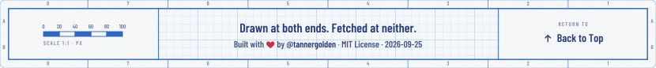</picture>

### A profile, read from the person

In a profile repository the same header reads a person: their name, their
bio, their status as the sheet's one note, and along the foot their
followers, repositories, the stars those earned, their contributions in the
last year, their main language and the year they joined. The snapshot below
was read without GitHub's GraphQL API, the only one that knows a status or a
year's contributions, so it shows neither; a real run draws both.

<picture><source media="(prefers-color-scheme: dark)" srcset="assets/gallery/h2-profile-dark.svg"></picture>

### Eleven prints and a rainbow

`theme` picks the print the whole set is drawn in: its lines on white by day,
its sheet by night. The spectrum runs red to pink, then the Van Dyke and the
black-line prints of the same trade. Each strip below is a night sheet, and
says its own theme:

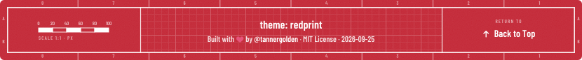
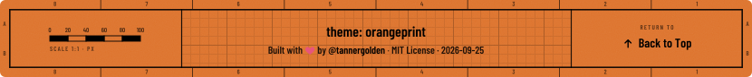
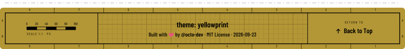
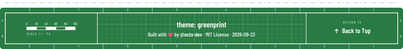
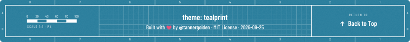
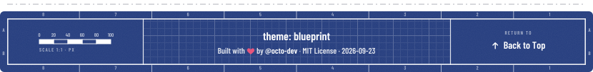
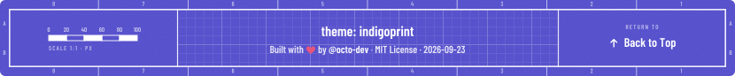
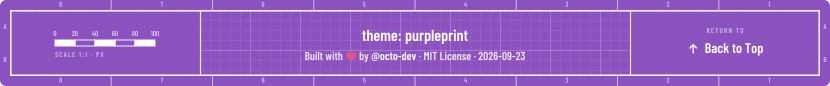
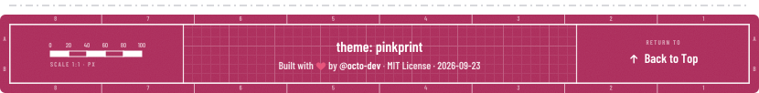
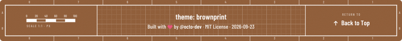
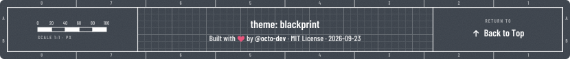

**`theme: rainbowprint`** draws each update in the next colour of the
spectrum: a README whose banners were redrawn in greenprint today will be
tealprint the next time something they show moves. The lock remembers where
it is, and a quiet day keeps the colour it has.

---

## 🚀 Use It In Your README

Add this as `.github/workflows/banners.yml` in any repository. That stub is
the whole interface: with no config at all, the README gets H2 Section over
F1 Title block, in blueprint, every word and figure read from GitHub.

```yaml
name: Banners
on:
  schedule:
    - cron: '0 0 * * *'
  workflow_dispatch:

permissions: {}

jobs:
  banners:
    permissions:
      contents: write
      pull-requests: write
    uses: tannergolden/banners/.github/workflows/banners.yml@v1
```

Run it once from the Actions tab. The first run puts the header block at the
top of your README and the footer block at its foot, between
`<!-- banners:header:start -->` and `<!-- banners:header:end -->` and the
footer's pair (move the markers wherever you like; later runs rewrite only
what is between them), draws into `assets/banners/`, and commits. Nothing is
copied into your repository except that stub.

**Who the commit is by.** Each refresh is authored by
[@tannergolden](https://github.com/tannergolden), the author of the drawing,
and committed by `github-actions[bot]`, which is what pushed it, as emblems
and trophies do. The kit recognises its own commits by their
`chore(banners)` scope, and any commit a bot pushed, and sets them aside when
it reads your last change, so a refresh never moves the date it draws. The
`author` input on the workflow changes the name if you want a different one.

### Or a profile

In your **profile repository**, the one named after your account, the same
stub reads you instead: `mode: auto`, the default, knows the repository by
its name. [`examples/stub-profile.yml`](examples/stub-profile.yml) spells it
out, and [`examples/stub-repository.yml`](examples/stub-repository.yml) shows
a repository with `commit: pr`, which opens one evolving pull request instead
of pushing.

### Or gate on it

Banners are committed files, so they can be checked like any other. With
`check: true` the same workflow measures nothing and commits nothing: it
redraws the banners from the measurement the lock remembers and fails if any
file or README block differs from what the kit draws. No token is used, so it
runs on a pull request from a fork:
[`examples/stub-check.yml`](examples/stub-check.yml).

### Options

Everything is optional, and an empty text field is read from GitHub. A
[`.github/banners.yml`](examples/banners.yml) in your repository can set:

| Key           | Default           | Meaning                                                                                        |
| :------------ | :---------------- | :--------------------------------------------------------------------------------------------- |
| `mode`        | `auto`            | `auto`, `profile` or `repository`. Auto reads a profile in the repository named after its owner. |
| `subject`     | this repository   | A login, or `owner/name`. Empty means this repository, or its owner.                           |
| `header`      | `section`         | `section` (H2), `sheet` (H1), `strip` (H3) or `none`.                                          |
| `footer`      | the header's pair | `title-block` (F1), `scale-bar` (F2) or `none`.                                                |
| `theme`       | `blueprint`       | Any of the eleven prints, or `rainbowprint`.                                                   |
| `title`       | from GitHub       | The repository's name, or your name.                                                           |
| `tagline`     | from GitHub       | The repository's description, or your bio.                                                     |
| `motto`       | none              | The sheet's one general note. On a profile, your status message.                               |
| `description` | none              | A longer line under the note.                                                                  |
| `figures`     | the mode's        | Which figures run along the foot, in order.                                                    |
| `closing`     | none              | The footer's closing phrase.                                                                   |
| `top`         | `Back to Top`     | The words on the footer's way back up. The whole footer links to the top either way.           |
| `links`       | from GitHub       | Up to four buttons under the footer. Empty: the first four pages GitHub has for it, below.     |
| `hide`        | `[]`              | Fields not drawn at all.                                                                       |
| `readme`      | `manage`          | Manage the blocks between the markers, or `none`.                                              |
| `readme_path` | `README.md`       | The file that holds the markers.                                                               |
| `out`         | `assets/banners`  | Where the SVGs are written.                                                                    |
| `lock`        | `true`            | Keep `.github/banners.lock.json`.                                                              |

The list of fields not drawn is `hide`, not `off`: YAML reads a bare `off` as
`false`. The workflow also takes `mode`, `subject`, `header`, `footer`,
`theme`, `commit` (`push` or `pr`), `commit-branch`, `kit-ref` (the banners ref
to run, `v1` by default), `author` (who the refresh commit is by) and `check`
(verify the committed banners instead of refreshing them) as inputs, for the
common cases without a config file.

---

## 🎯 What Gets Measured

**A repository**, by default: its name, description, latest release, stars,
forks, open issues, primary language and licence, and on request its
watchers, open pull requests, creation year and website. **A person**, in
profile mode: name, bio, status, followers, public repositories and the
stars they earned, contributions in the last year as GitHub counts them,
main language and the year they joined, and on request following, location,
company and website. A figure GitHub has no value for is left out rather than
drawn as a blank.

**Four buttons under the footer.** Name up to four links in `links` and
those are the buttons. Name none and a repository gets the first four of
Issues, Pull Requests, Releases, Actions, Discussions and Contributors that
it actually has, so an empty tab is never a button; a profile gets the
person's website, when they have one, then Repositories, Projects, Packages
and Stars.

**The last change is a person's.** The footer's date is the newest commit on
the default branch that a person made. A commit a bot pushed, and a refresh
of this kit or of trophies, never counts, so the date moves when your project
does and not when a workflow tidies it.

**Words are drawn as they were written.** Lettering is outlined from Barlow
Condensed with every letter of Latin-1 and Latin Extended-A, so a name reads
as its owner wrote it. A dash the standards ban becomes a hyphen, a GitHub
`:shortcode:` is dropped, and a character the letters cannot draw is left out
with a note in the run's summary. The alt text is built from exactly what the
image shows.

**[`docs/Banner-Kit.md`](docs/Banner-Kit.md)** has every figure, every field
and where it comes from, and the four GraphQL documents are written out in
full in [`src/bannerkit/measure.py`](src/bannerkit/measure.py).

---

## 🔁 How It Runs

Once a day, at midnight. Nothing on a banner changes faster than daily, and
GitHub may delay a scheduled run when it is busy, which costs nothing here.

**Every run measures everything again.** Nothing depends on the last run, so
a delayed or skipped one loses nothing. A run costs a handful of API calls,
well inside what `GITHUB_TOKEN` is allowed.

**A quiet day writes nothing.** A file changes only when something it shows
does, so most days make no commit. The **lock**,
`.github/banners.lock.json`, remembers the measurement the committed banners
were drawn from, which is what lets `check` redraw them with no token, and
where a rainbowprint is in the spectrum. It is written when a drawing
changed, and once a week regardless; that weekly commit is what keeps GitHub
from switching the schedule off after sixty quiet days.

**Every commit is a Conventional Commit, and no two read alike.** Each
refresh is a `chore(banners): 🪧 …` commit whose subject names what moved,
such as `redraw with release v2.4.1 and 1,285 stars`, and whose body carries
what the banners now show, what they showed before, the date and the run, per
the [commit standard](https://github.com/tannergolden/standards/blob/Development/docs/distribution/Conventional-Commits.md).

**Every file is checked before it is written.** No script, no external
reference, no `foreignObject`, emblems' 64 colour tokens and nothing else,
text as paths, a title and a description on every image, and a size budget.
Drawing is deterministic, so the same measurement draws byte-identical files,
and it prunes: a file the plan no longer names is deleted.

---

## 🧭 Layout

```bash
banners/
├── action.yml                        the composite action
├── .github/workflows/banners.yml     the reusable workflow your stub calls
├── .github/workflows/own-banners.yml this README's own banners, at its own commit
├── .github/workflows/cut-release.yml cuts a version and moves v1, via the standards
├── .github/banners.yml               this README's own config
├── .github/banners.lock.json         this README's lock
├── src/
│   ├── banner-kit.py                 the command line
│   ├── extract-glyphs.py             where the glyph supplement comes from, and its proof
│   ├── bannerkit/
│   │   ├── measure.py, github.py     what is read from GitHub, and the client
│   │   ├── compose.py, config.py     each field's words, and the config file
│   │   ├── headers.py, footers.py    the three headers and two footers
│   │   ├── drafting.py               the sheet, dimensions, schedule and prints
│   │   ├── plan.py, readme.py        the plan of files, the README blocks, the commit message
│   │   ├── lock.py                   what persists between runs
│   │   └── preview.py, page/         the preview page, running this package in the browser
│   └── fonts/                        glyph outlines and their OFL licences
├── assets/banners/                   this README's committed banners
├── assets/gallery/                   the gallery above, drawn from the samples
├── examples/                         stubs and a starter config to copy
├── tests/                            the unit tests, and the GraphQL document check
└── docs/
    └── Banner-Kit.md                 the full specification
```

---

## 🛠️ Working On It

For developing the kit itself, in a clone. Consuming it needs none of this,
only the stub above.

```bash
make help       # list every target
make check      # CI gate: every design lints in every print, queries well formed, gallery and own banners current
make test       # the gate plus the unit tests
make gallery    # redraw assets/gallery/ from the samples
make sample     # draw the sample repository and profile into preview/, the way a run would (no network)
make preview    # build preview/preview.html: every design, drawn live in the browser by this same package
make schema     # check every GraphQL query against GitHub's published schema
```

`make preview` builds a page with every design and theme on it, drawn by
this same package running in the browser under Brython. Before it draws
anything live it redraws a sample and compares it with the kit's own output,
byte for byte. It fetches Brython once, pinned by checksum, into `.cache/`.

To measure a real repository or account locally:

```bash
GITHUB_TOKEN=... python3 src/banner-kit.py measure --subject octocat/Hello-World > m.json
python3 src/banner-kit.py render --root /tmp/readme --from m.json
```

### Releasing

Every stub pins `@v1`, a moving major tag, and the reusable workflow fetches
the kit at that same tag. A version is cut by dispatching **🏷️ Cut Release**
with `vX.Y.Z`: the stub calls the standards' release workflow, which refuses a
commit that is not on the default branch or a version that does not move
forward, proves the workflow, the action and the kit exist at the commit and
that `make check` passes, then tags the immutable version, force-moves `v1`,
publishes the release with generated notes and prunes the pages it
superseded. Version tags are never deleted, so a full-version pin keeps
resolving. A release that changes what a banner looks like bumps
`KIT_VERSION`, and every README redraws on its next run.

Full specification: [`docs/Banner-Kit.md`](docs/Banner-Kit.md).

---

## 📄 License

MIT. See [`LICENSE`](LICENSE).

The glyph outlines in `src/fonts/` are from
[Cinzel](https://github.com/NDISCOVER/Cinzel) and
[Barlow](https://github.com/jpt/barlow), both under the SIL Open Font License
1.1, which permits embedding them in a document. The preview page embeds
[Brython](https://brython.info), under the BSD 3-Clause License, when it is
built. [`NOTICE`](NOTICE) records the attributions; the font licences travel
in `src/fonts/`.

---

## 🔗 See also

> [!TIP]
> The full specification is [`docs/Banner-Kit.md`](docs/Banner-Kit.md).
> [`tannergolden/emblems`](https://github.com/tannergolden/emblems) draws the
> badges a repository commits for itself, and
> [`tannergolden/trophies`](https://github.com/tannergolden/trophies) draws a
> profile's or a repository's trophies, the way this draws its banners: in the
> same palette, under the same rule. The engineering standards this repository
> follows are published in
> [`tannergolden/standards`](https://github.com/tannergolden/standards), and it
> was generated from [`tannergolden/path`](https://github.com/tannergolden/path).

---


<!-- banners:footer:start -->
<div align="center">

<a href="#top">
<picture>
  <source media="(max-width: 585px) and (prefers-color-scheme: dark)" srcset="assets/banners/footer-narrow-dark.svg">
  <source media="(max-width: 585px)" srcset="assets/banners/footer-narrow-day.svg">
  <source media="(prefers-color-scheme: dark)" srcset="assets/banners/footer-dark.svg">
  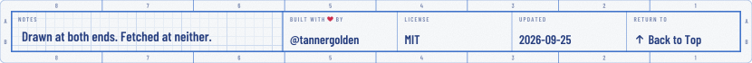
</picture>
</a>

<a href="https://github.com/tannergolden/banners/issues"><picture><source media="(prefers-color-scheme: dark)" srcset="assets/banners/link-issues-dark.svg"></picture></a>
<a href="https://github.com/tannergolden/banners/pulls"><picture><source media="(prefers-color-scheme: dark)" srcset="assets/banners/link-pull-requests-dark.svg"></picture></a>
<a href="https://github.com/tannergolden/banners/releases"><picture><source media="(prefers-color-scheme: dark)" srcset="assets/banners/link-releases-dark.svg"></picture></a>
<a href="https://github.com/tannergolden/banners/actions"><picture><source media="(prefers-color-scheme: dark)" srcset="assets/banners/link-actions-dark.svg"></picture></a>

</div>
<!-- banners:footer:end -->
