<!--
title: '📐 ELEMENTS KIT'
description: 'The body of a README, drawn for itself: a schematic, instruments, a floor plan, milestones, a roster, a certificate, placards and a seal, measured from the repository and drawn as committed SVGs.'
tags: [readme, documentation, svg, blueprint, github-actions, reusable-workflow, diagram, floor-plan, timeline]
category: docs
-->

<div align="center">

# 📐 Elements Kit

<a name="top"></a>

**The body of a README, drawn for itself.**

A schematic, instruments, a floor plan, milestones, a roster, a certificate, placards and a seal:
measured from the repository, drawn as committed SVGs, never fetched.

</div>

---

## 💡 What This Is

A README explains a project in prose, and in a few screenshots that are out
of date by the second release. This draws the parts a reader actually looks
for, as engineering drawings, from what the repository can measure about
itself: how the code is laid out, how it runs, who drew it, how it has been
released, and which checks it passes. The banners in this same repository
draw the two ends of a page, its header and its footer; the elements draw
its body. Each is a **committed SVG** in one blueprint language, shared with
[`tannergolden/badges`](https://github.com/tannergolden/badges) and
[`tannergolden/trophies`](https://github.com/tannergolden/trophies), so a page
built from all of them reads as one set of drawings, in one palette, under
one rule.

The goal is a README people enjoy, made without effort: one stub in your
repository, a data file the first run writes for you, and a page that keeps
itself current. Eight elements:

| Element         | What it draws                                                                                   | You write                              | It measures                          |
| :-------------- | :---------------------------------------------------------------------------------------------- | :------------------------------------- | :----------------------------------- |
| **schematic**   | Boxes and the wires between them, layered, snaked across the sheet and routed around each other | The boxes, the wires, the notes        | Nothing                              |
| **instruments** | Commits per week, days since the last release, tracked bytes by file type, three counters       | Globs for the counters                 | All of it, from git                  |
| **plan**        | The repository as a floor plan: folders as rooms sized by file count, doors on shared walls     | Notes and the entrance                 | The tree, from git                   |
| **milestones**  | Every version tag on a time line, quiet stretches cut, what is planned in outline               | Notes on the releases that matter      | The tags and their dates             |
| **roster**      | Each contributor in a medallion, with their commits, first and last                             | Renames, if any                        | The log, co-authors included         |
| **certificate** | The checks a checkout can answer, each with its evidence, under the seal                        | The words on the ring                  | Licence, security policy, pins, commit style, CI |
| **placard**     | A card for a related repository: description, language, release, with a link                    | Owner, name, cells                     | From GitHub, given a token           |
| **seal**        | The certificate's stamp on its own                                                              | The ring, the name                     | Nothing                              |

Every element is written as a **day** file and a **dark** file, and most as
a **narrow** file for a phone. The README shows the right one through a
`<picture>` element that follows the viewer's theme and width, the method
GitHub documents. Nothing is fetched at view time.

It is one stub in your repository and one kit here, beside the banners:

| Part                              | Job                                                                                         |
| :-------------------------------- | :------------------------------------------------------------------------------------------ |
| `.github/workflows/elements.yml`  | **The workflow.** Checkout, kit, commit, push. What your stub calls.                        |
| `elements/action.yml`             | **The action.** Runs the kit against the calling repository.                                |
| `src/elements-kit.py`             | **The kit.** `run`, `init`, `measure`, `render`, `check` and `snippets`.                     |
| `src/elementskit/elements.py`     | **The eight elements**, drawn with the banners' drafting tools and lettered with its faces. |
| `src/elementskit/layout.py`       | **The layouts.** Treemap, spanning tree, layering, orthogonal routing, the time line.       |
| `src/elementskit/measure.py`      | **The measurement.** What is read from git and GitHub, written out in full.                 |

**Called, never copied.** Your repository holds a stub that names the
schedule. The measuring, drawing and committing happen here, so a fix lands
once and reaches every README pinned to `v1`.

---

## 🖼️ What It Looks Like

[driftmark](../examples/driftmark/README.md) is a made-up project whose README
uses every element. The page is drawn by this kit from
[`examples/driftmark/.github/elements.yml`](../examples/driftmark/.github/elements.yml),
and each image below is one of its files, in blueprint. Every one of them
exists in dark as well; switch your theme to see it. The
[README of this repository](../README.md#-the-body-of-the-page) shows the
measured elements drawn live for a real one.

### Schematic

Boxes and the wires between them. You name the boxes and say which connects
to which; the kit layers them along the wires, snakes the rows across the
sheet so every wire is short, routes each one around the boxes in its way and
sets its label in a gap in its longest run, clear of every other wire. A
phone gets one box to a row, with the wires that skip a row carried down a
channel at the right.

<picture><source media="(prefers-color-scheme: dark)" srcset="../examples/driftmark/assets/elements/how-it-runs-dark.svg">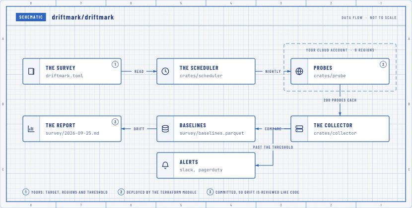</picture>

### Instruments

Four instruments from git: commits per week as a histogram, days since the
last release as a dial, tracked bytes by file type as a section through the
tree, and three counters for whatever you give a glob for.

<picture><source media="(prefers-color-scheme: dark)" srcset="../examples/driftmark/assets/elements/vitals-dark.svg">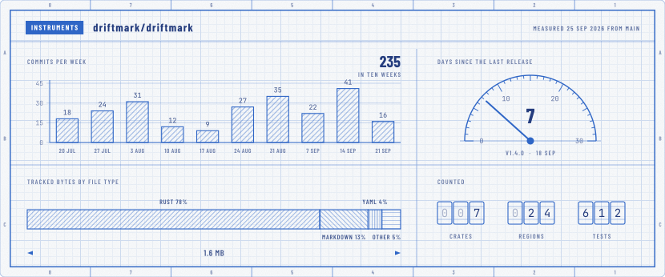</picture>

### Plan

The repository as a floor plan. Each top-level folder is a room whose area
is its share of the files, laid out as a treemap and squared up; the root is
the lobby, and small folders are closets along one wall. Doors are cut where
rooms share a wall, on a spanning tree, so every room can be reached and no
wall has two. Numbered notes call out what to look at.

<picture><source media="(prefers-color-scheme: dark)" srcset="../examples/driftmark/assets/elements/layout-dark.svg">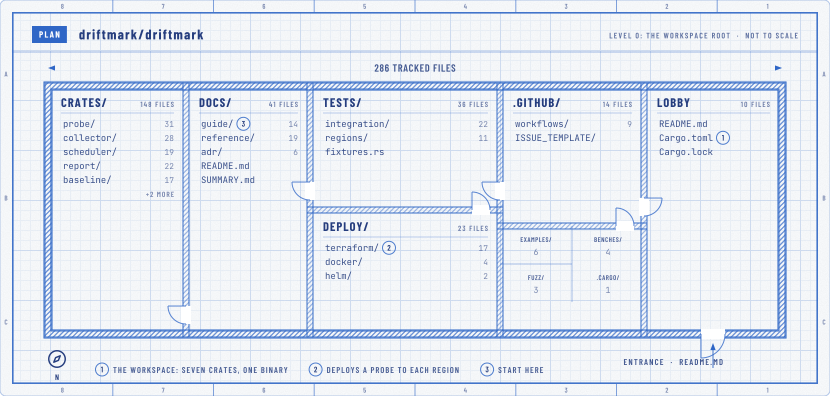</picture>

### Milestones

Every version tag on one line. Minor releases are dots, the ones you note
are diamonds with their notes above, a major is drawn larger, and a stretch
with nothing in it is cut and labelled so a year of quiet does not push the
releases together. What is planned is drawn in outline with the month it is
due.

<picture><source media="(prefers-color-scheme: dark)" srcset="../examples/driftmark/assets/elements/history-dark.svg">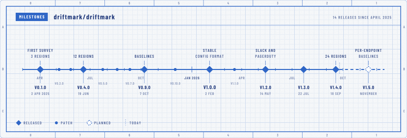</picture>

### Roster and certificate

The people who drew it, each in a medallion with their commits and their
first and last, co-authors counted. Beside it, the checks the repository is
held to, each with the evidence for it, under the seal. Both are drawn at
half a page, so they sit side by side.

<div align="center">
<picture><source media="(prefers-color-scheme: dark)" srcset="../examples/driftmark/assets/elements/contributors-dark.svg">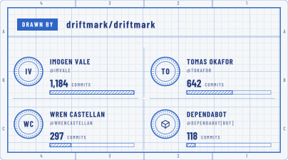</picture>
<picture><source media="(prefers-color-scheme: dark)" srcset="../examples/driftmark/assets/elements/conformance-dark.svg">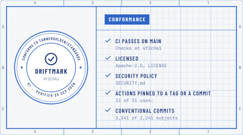</picture>
</div>

### Placards and the seal

A placard is a card for a related repository: its description, language and
release, read from GitHub, linked to the page. The seal is the certificate's
stamp on its own, for the foot of a page.

<div align="center">
<picture><source media="(prefers-color-scheme: dark)" srcset="../examples/driftmark/assets/elements/action-dark.svg">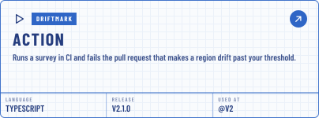</picture>
<picture><source media="(prefers-color-scheme: dark)" srcset="../examples/driftmark/assets/elements/terraform-probes-dark.svg">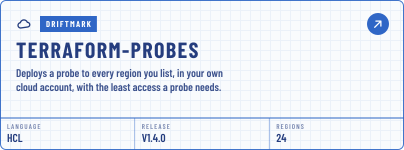</picture>

<picture><source media="(prefers-color-scheme: dark)" srcset="../examples/driftmark/assets/elements/stamp-dark.svg">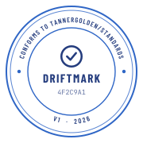</picture>
</div>

### On a phone

Each element has a file drawn for a narrow page, not the wide one shrunk:
the schematic stacks, the plan re-flows its rooms, the milestones become a
list, and the instruments take two rows. GitHub picks it below 585 pixels.

<div align="center">
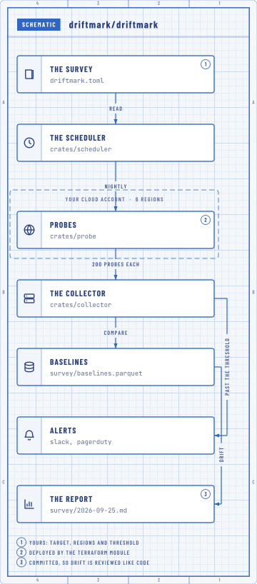
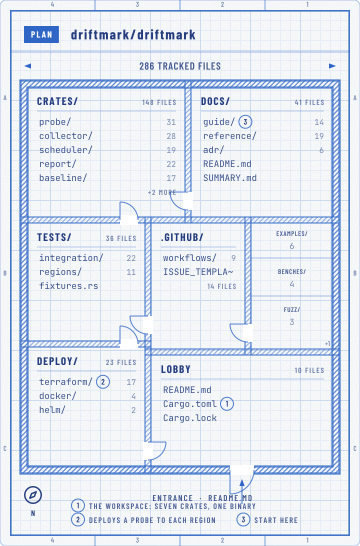
</div>

---

## 🚀 Use It In Your README

Add this as `.github/workflows/elements.yml` in any repository. That stub is
the whole interface.

```yaml
name: Elements
on:
  schedule:
    - cron: '0 8 * * *'
  workflow_dispatch:

permissions: {}

jobs:
  elements:
    permissions:
      contents: write
      pull-requests: write
    uses: tannergolden/banners/.github/workflows/elements.yml@v1
```

Run it once from the Actions tab. The first run writes
`.github/elements.yml` with the five elements that need nothing written by
hand (instruments, plan, milestones, roster and certificate), puts a pair of
markers for each at the foot of your README, measures the repository, draws
every element into `assets/elements/` and commits. Move the markers wherever
you like, between `<!-- elements:ID:start -->` and
`<!-- elements:ID:end -->`; later runs rewrite only what is between them.
Once a day it measures again and redraws whatever moved; a day on which
nothing moved commits nothing.

Then open the data file. Add a schematic by naming its boxes and wires, a
placard by naming a repository, a seal by writing its ring. Give any element
a `title:`, a `caption:` or a `desc:` of your own.
[`examples/stub-elements.yml`](../examples/stub-elements.yml) is the stub
above with its options; `commit: pr` opens one evolving pull request instead
of pushing. It sits beside the banners' stub, and the two can share a
repository: each writes only between its own markers.

**Who the commit is by.** Each refresh is authored by
[@tannergolden](https://github.com/tannergolden), the author of the drawing,
and committed by `github-actions[bot]`, which is what pushed it, as banners,
badges and trophies do. Its subject is `chore(elements)`, so the roster
and the history know a refresh from a change. The `author` input on the
workflow changes the name if you want a different one.

### Or gate on it

Elements are committed files, so they can be checked like any other. With
`check: true` the same workflow measures nothing and commits nothing: it
redraws the elements from the measurement the lock remembers and fails if
any file or README block differs from what the kit draws. No token is used,
so it runs on a pull request from a fork:
[`examples/stub-elements-check.yml`](../examples/stub-elements-check.yml).

### Or by hand

The kit is one Python file and its package, in a clone of this repository.
It letters with the banners' outlines, which sit beside it in `src/`.

```bash
python3 src/elements-kit.py init --root ~/my-repo      # a starter .github/elements.yml and the README's markers
python3 src/elements-kit.py measure --root ~/my-repo   # git and GitHub into .github/elements.lock.json
python3 src/elements-kit.py render --root ~/my-repo    # every file into assets/elements/, every block into README.md
python3 src/elements-kit.py check --root ~/my-repo     # exit 1 when a file or a block has drifted from the data
python3 src/elements-kit.py snippets --root ~/my-repo  # print each element's <picture>, to paste anywhere
python3 src/elements-kit.py run --root ~/my-repo       # init when there is no data file, then measure and render
```

Every command takes `--root` (this checkout when omitted), `--data`, `--out`, `--readme` and `--lock`.
The data file is YAML, read with PyYAML, which GitHub's runners already have;
write `elements.json` instead and nothing beyond the standard library is
needed.

### The data file

```yaml
print: blueprint          # any of the eleven prints below
subject: owner/name       # what the title blocks say; the first run reads it from origin
today: 2026-09-25         # optional: the date the measurement is as of, for a reproducible page

elements:
  ID:                     # the file names and the README markers: letters, digits and dashes
    kind: plan            # one of the eight
    title: ...            # the file's accessible title; a sensible one is written when you give none
    desc: ...             # its accessible description, likewise
    caption: ...          # the small words at the top right of a sheet
    link: https://...     # wraps the picture in a link
    size: half            # a roster or a certificate at half a page
    measure: {...}        # what to read from git or GitHub; {} asks for the defaults
```

Anything you write for an element wins over what was measured for it, so a
measured element can still carry your caption, or a hand-written line. A
measured plan takes notes on its rooms by key: `rooms: [{key: src, notes:
[[1, 0]]}]` puts note 1 on the first line of the measured `src/` room, and
a room written in full, with its `count`, is added beside the measured ones.
What each kind takes:

| Kind            | Measured with                                                                 | Written by hand                                                                                                                                                                      |
| :-------------- | :---------------------------------------------------------------------------- | :----------------------------------------------------------------------------------------------------------------------------------------------------------------------------------- |
| **schematic**   | Nothing                                                                       | `boxes` as `key: {title, path, icon, note, in}`, `wires` as `[from, to, label]`, `groups` as `key: label` for a dashed enclosure, `notes` as `[number, text]`                        |
| **instruments** | `measure: {weeks: 10, count: {label: "glob", ...}}`, up to three counters     | `histogram {label, sum, peak, ticks, bars: [[label, n]]}`, `dial {label, value, span, major, minor, sub}`, `materials {label, total, parts: [[label, bytes]]}`, `counters [[label, n]]` |
| **plan**        | `measure: {hide: [paths]}`                                                    | `total`, `entrance`, `rooms` as `{key, label, count, lines: [[name, n]], notes: [[number, line]], far}`, `lobby`, `closets` as `{label, count}`, `notes`                              |
| **milestones**  | `measure: {notable: {v1.0.0: [A NOTE, ANOTHER]}, planned: [{tag, date, when, above}]}` | `start`, `end`, `events` as `{date, tag, above: [lines], major, big, next, when}`                                                                                              |
| **roster**      | `measure: {most: 4, bots: true, rename: {match: {name, handle, initials}}}`   | `people` as `{name, handle, initials, n, first, last, icon}`                                                                                                                         |
| **certificate** | `measure: {ci: main}`, the branch CI is read for, given a token               | `checks` as `[label, evidence]`, `ring_top`, `ring_bottom`, `name`, `commit`                                                                                                         |
| **placard**     | `measure: {repo: owner/name}`, given a token                                  | `owner`, `name`, `desc`, `icon`, `cells` as three `[label, value]` pairs                                                                                                             |
| **seal**        | Nothing                                                                       | `ring_top`, `ring_bottom`, `name`, `commit`                                                                                                                                          |

The specimen's [`elements.yml`](../examples/driftmark/.github/elements.yml)
writes every field of every kind by hand, since driftmark has no git history
to measure, and reads as a complete example. The lettering covers the Latin
alphabet, digits and the punctuation of a path or a version; a character
outside it is written in its plain spelling where one exists, and as `?`
with a warning where none does.

---

## 🎨 Eleven Prints

`print` picks the print the whole page is drawn in: its lines on white by
day, its sheet by night. The spectrum runs red to pink, then the Van Dyke
and the black-line prints of the same trade: `redprint`, `orangeprint`,
`yellowprint`, `greenprint`, `tealprint`, `blueprint` (the default),
`indigoprint`, `purpleprint`, `pinkprint`, `brownprint` and `blackprint`.
The prints are the banners' own, so a page whose header, elements and footer
are drawn in the same print matches to the hex.

---

## 🔁 How It Runs

1. **Measure.** `measure` reads git for what the checkout knows (the tree,
   the log, the tags, a command's output, the checks) and GitHub for what
   only it knows (a placard's repository, CI's verdict), and writes the
   result to `.github/elements.lock.json` in full. The lock is committed, so
   a page can be redrawn without measuring again, and reviewed like any
   other change.
2. **Render.** `render` merges the data file over the lock, lays each
   element out, draws it in every variant and both themes, and writes each
   file only when its bytes changed. Then it writes each element's
   `<picture>` between its markers in the README. An element whose markers
   are missing is still drawn, and the run says so.
3. **Check.** `check` redraws everything from the lock and fails when any
   file or block on disk differs. It also names files drawn by an older kit
   version, which the next render re-stamps.

Every file passes the banners' lint: only palette colours, no `<text>`,
every id defined, and a size budget (72 KB for a sheet, 32 KB for a card),
so a page of a dozen elements weighs less than a few screenshots would. Each file
carries the kit version it was drawn by, and a release that changes what an
element looks like bumps `KIT_VERSION`, so every README redraws on its next
run.

---

## 🛠️ Working On It

For developing the kit itself, in a clone. Consuming it needs none of this,
only the stub above.

```bash
make test                                              # the whole gate: banners and elements, and every unit test
python3 -m unittest tests.test_elements                # the elements alone
python3 src/elements-kit.py render --root examples/driftmark   # redraw the specimen after a change to the kit
make elements                                          # redraw this README's own elements from git
```

The tests draw every element in every variant, theme and print and lint each
one, exercise the layouts on their edge cases (a plan with one room, a
schematic with a cycle, a time line with nothing quiet enough to cut), and
run the command line end to end on a copy of the specimen and on this
checkout: `run` on a bare copy writes the data file and the markers,
measures, draws, words its commit, and is quiet the second time. A release
of this repository proves the elements' files exist and that `make check`
passes before it moves `v1`, the same as for the banners.

---

## 📄 License

MIT. See [`LICENSE`](../LICENSE).

The monospace outlines in `src/fonts/jetbrains-mono.json` are from
[JetBrains Mono](https://github.com/JetBrains/JetBrainsMono), under the SIL
Open Font License 1.1, which permits embedding them in a document; the
licence travels beside them. The other faces are the banners' own, Barlow
Condensed and Cinzel, under the same licence.

---

## 🔗 See also

> [!TIP]
> The banners in this repository draw a README's header and footer, and
> [`docs/Banner-Kit.md`](Banner-Kit.md) is their specification.
> [`tannergolden/badges`](https://github.com/tannergolden/badges) draws its
> badges and [`tannergolden/trophies`](https://github.com/tannergolden/trophies)
> a profile's or a repository's trophies, the way this draws the body of the
> page: in the same palette, under the same rule. The engineering standards
> these repositories follow are published in
> [`tannergolden/standards`](https://github.com/tannergolden/standards).
