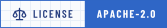
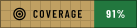
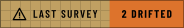
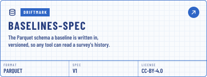

<!-- banners:header:start -->
<!-- markdownlint-disable MD041 -->

<div align="center">

<a name="top"></a>

<picture>
  <source media="(max-width: 585px) and (prefers-color-scheme: dark)" srcset="assets/banners/header-narrow-dark.svg">
  <source media="(max-width: 585px)" srcset="assets/banners/header-narrow-day.svg">
  <source media="(prefers-reduced-motion: reduce) and (prefers-color-scheme: dark)" srcset="assets/banners/header-still-dark.svg">
  <source media="(prefers-reduced-motion: reduce)" srcset="assets/banners/header-still-day.svg">
  <source media="(prefers-color-scheme: dark)" srcset="assets/banners/header-dark.svg">
  
</picture>

</div>
<!-- banners:header:end -->

<div align="center">

<picture><source media="(prefers-color-scheme: dark)" srcset="assets/badges/static/release-dark.svg"></picture>
<picture><source media="(prefers-color-scheme: dark)" srcset="assets/badges/static/license-dark.svg"></picture>
<picture><source media="(prefers-color-scheme: dark)" srcset="assets/badges/static/rust-dark.svg"></picture>
<picture><source media="(prefers-color-scheme: dark)" srcset="assets/badges/static/platforms-dark.svg"></picture>





</div>

**driftmark measures your API from every region you deploy to, every night, and tells you which ones got
slower.** Your load balancer draws its latency graphs from where the load balancer sits. Your users are in
São Paulo and Frankfurt. driftmark puts a probe in each region you name, keeps a baseline for each one, and
raises an alert when a region drifts past the threshold you set, before your users notice it for you.

[What it does](#what-it-does) · [Use it](#use-it) · [How it runs](#how-it-runs) ·
[The repository](#the-repository) · [Ecosystem](#ecosystem) · [Working on it](#working-on-it) ·
[License](#license)

---

## What It Does

One command, six regions, two hundred probes each. The survey compares every region's p95 with its own
baseline, not with a global number, because 171 ms from São Paulo is normal and 171 ms from Virginia is an
incident. Here is a survey, start to finish, on a night when two regions had drifted:

```text
$ driftmark survey
Surveying api.example.com/health from 6 regions, 200 probes each.
  region             p50      p95   baseline   change
  us-east-1         38 ms   71 ms    69 ms     +3%
  us-west-2         52 ms   96 ms    92 ms     +4%
  eu-west-1         61 ms  118 ms   121 ms     -2%
  eu-central-1      64 ms  187 ms   133 ms    +41%
  ap-southeast-1   142 ms  263 ms   255 ms     +3%
  sa-east-1        171 ms  402 ms   247 ms    +63%
2 regions drifted past the 30% threshold on p95.
Report written to survey/2026-09-25.md. Alert sent to #latency.
$
```

The exit code is the verdict, so a survey drops straight into CI or a cron job:

| Exit | Meaning |
| :--: | :------ |
| `0` | Every region is within the threshold of its baseline. |
| `1` | The survey could not run: a bad config, or no probe answered. |
| `2` | At least one region drifted. The report names which, and by how much. |

---

## Use It

### Install and run

```sh
cargo install driftmark
driftmark init --target https://api.example.com/health
driftmark survey
```

`init` writes a `driftmark.toml` with six regions to start from (`us-east-1`, `us-west-2`, `eu-west-1`, `eu-central-1`, `ap-southeast-1`, `sa-east-1`) and a 30% threshold on p95.
The first survey records the baselines; every survey after it is measured against them.

### Configure

```toml
[survey]
target    = "https://api.example.com/health"
regions   = ["us-east-1", "us-west-2", "eu-west-1", "eu-central-1", "ap-southeast-1", "sa-east-1"]
probes    = 200          # per region, per survey
schedule  = "nightly"    # or a cron expression
threshold = "30%"        # on p95, against each region's own baseline

[alerts]
slack     = "env:SLACK_WEBHOOK"
pagerduty = "env:PAGERDUTY_KEY"
```

<details>
<summary>Every key</summary>

| Key | Default | Meaning |
| :-- | :------ | :------ |
| `survey.target` | none | The URL every probe requests. |
| `survey.regions` | six nearest | Cloud regions to probe from, by their provider's name. |
| `survey.probes` | `200` | Requests per region, per survey. |
| `survey.schedule` | `nightly` | When the scheduler runs a survey. |
| `survey.threshold` | `30%` | How far p95 may move from its baseline before a region has drifted. |
| `alerts.slack` | none | A webhook, read from the environment. |
| `alerts.pagerduty` | none | An integration key, read from the environment. |

</details>

### Or gate a pull request on it

[`driftmark/action`](https://github.com/driftmark/action) runs a survey against a staging target and fails
the pull request that makes a region drift:

```yaml
- uses: driftmark/action@v2
  with:
    target: https://staging.api.example.com/health
    threshold: 30%
```

---

## How It Runs

<!-- elements:how-it-runs:start -->
<picture>
  <source media="(max-width: 585px) and (prefers-color-scheme: dark)" srcset="assets/elements/how-it-runs-narrow-dark.svg">
  <source media="(max-width: 585px)" srcset="assets/elements/how-it-runs-narrow-day.svg">
  <source media="(prefers-color-scheme: dark)" srcset="assets/elements/how-it-runs-dark.svg">
  
</picture>
<!-- elements:how-it-runs:end -->

1. **The survey** is a TOML file you commit. It names the target, the regions and the threshold.
2. **The probes** run in your own cloud account, one per region, deployed by
   [`driftmark/terraform-probes`](https://github.com/driftmark/terraform-probes). Nothing leaves your account.
3. **The report** is Markdown, written to `survey/` and committed, so a drift is reviewed like any other
   change, with its numbers in the diff.

---

## The Repository

Two sheets, drawn by CI from the repository itself and committed with it, so they are as current as the
last push. The vitals are measured from `git log` and the tree, and the history from the tags.

### Vitals

<!-- elements:vitals:start -->
<picture>
  <source media="(max-width: 585px) and (prefers-color-scheme: dark)" srcset="assets/elements/vitals-narrow-dark.svg">
  <source media="(max-width: 585px)" srcset="assets/elements/vitals-narrow-day.svg">
  <source media="(prefers-color-scheme: dark)" srcset="assets/elements/vitals-dark.svg">
  
</picture>
<!-- elements:vitals:end -->

### History

Fourteen releases since the first survey. The config format has been stable since v1.0.0, and the next
release brings per-endpoint baselines.

<!-- elements:history:start -->
<picture>
  <source media="(max-width: 585px) and (prefers-color-scheme: dark)" srcset="assets/elements/history-narrow-dark.svg">
  <source media="(max-width: 585px)" srcset="assets/elements/history-narrow-day.svg">
  <source media="(prefers-color-scheme: dark)" srcset="assets/elements/history-dark.svg">
  
</picture>
<!-- elements:history:end -->

---

## Ecosystem

<div align="center">

<!-- elements:action:start -->
<a href="https://github.com/driftmark/action">
<picture>
  <source media="(prefers-color-scheme: dark)" srcset="assets/elements/action-dark.svg">
  
</picture>
</a>
<!-- elements:action:end -->
<!-- elements:terraform-probes:start -->
<a href="https://github.com/driftmark/terraform-probes">
<picture>
  <source media="(prefers-color-scheme: dark)" srcset="assets/elements/terraform-probes-dark.svg">
  
</picture>
</a>
<!-- elements:terraform-probes:end -->

<!-- elements:grafana:start -->
<a href="https://github.com/driftmark/grafana">
<picture>
  <source media="(prefers-color-scheme: dark)" srcset="assets/elements/grafana-dark.svg">
  
</picture>
</a>
<!-- elements:grafana:end -->
<!-- elements:baselines-spec:start -->
<a href="https://github.com/driftmark/baselines-spec">
<picture>
  <source media="(prefers-color-scheme: dark)" srcset="assets/elements/baselines-spec-dark.svg">
  
</picture>
</a>
<!-- elements:baselines-spec:end -->

</div>

---

## Working On It

Every commit is a [Conventional Commit](https://www.conventionalcommits.org), and every pull request runs a
survey against a staging target before it merges. Start with the [guide](docs/guide/README.md); the
[reference](docs/reference/README.md) documents every crate. The people who drew it, and the checks the
repository is held to on every push:

<div align="center">

<!-- elements:contributors:start -->
<picture>
  <source media="(prefers-color-scheme: dark)" srcset="assets/elements/contributors-dark.svg">
  
</picture>
<!-- elements:contributors:end -->
<!-- elements:conformance:start -->
<picture>
  <source media="(prefers-color-scheme: dark)" srcset="assets/elements/conformance-dark.svg">
  
</picture>
<!-- elements:conformance:end -->

</div>

---

## License

Apache-2.0. See [`LICENSE`](LICENSE).

> [!NOTE]
> driftmark is a made-up project. It was invented to show every blueprint element in one README, and its
> numbers, contributors and history are fictional. `api.example.com` is a reserved example domain.

<div align="center">

<!-- elements:stamp:start -->
<a href="https://github.com/tannergolden/standards">
<picture>
  <source media="(prefers-color-scheme: dark)" srcset="assets/elements/stamp-dark.svg">
  
</picture>
</a>
<!-- elements:stamp:end -->

</div>

<!-- banners:footer:start -->
<div align="center">

<a href="#top">
<picture>
  <source media="(max-width: 585px) and (prefers-color-scheme: dark)" srcset="assets/banners/footer-narrow-dark.svg">
  <source media="(max-width: 585px)" srcset="assets/banners/footer-narrow-day.svg">
  <source media="(prefers-color-scheme: dark)" srcset="assets/banners/footer-dark.svg">
  
</picture>
</a>

<a href="docs/README.md"><picture><source media="(prefers-color-scheme: dark)" srcset="assets/banners/link-docs-dark.svg"></picture></a>
<a href="CHANGELOG.md"><picture><source media="(prefers-color-scheme: dark)" srcset="assets/banners/link-changelog-dark.svg"></picture></a>
<a href="https://github.com/driftmark/driftmark/releases"><picture><source media="(prefers-color-scheme: dark)" srcset="assets/banners/link-releases-dark.svg"></picture></a>
<a href="https://github.com/driftmark/driftmark/discussions"><picture><source media="(prefers-color-scheme: dark)" srcset="assets/banners/link-discussions-dark.svg"></picture></a>

</div>
<!-- banners:footer:end -->
